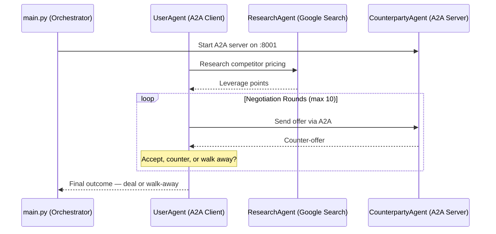

# 🤝 Haggle — AI-Powered Bill Negotiation Agent

<p align="center">
  
  
  
  
  
</p>

<p align="center"><b>Built for the All Things Agentic Hackathon — Taskmaster track</b></p>

---

Nobody wants to spend twenty minutes on the phone haggling over a subscription bill. **Haggle does it for you.**

Give it a service, your current price, and a target — it researches real competitor pricing, then negotiates round-by-round against an AI playing the retention department, until it lands a deal or walks away at your ceiling.

## How it works

Two Gemini-powered agents negotiate against each other over Google's **A2A (Agent-to-Agent) protocol** — not a simulated back-and-forth inside a single prompt, but two independently running agents actually talking over HTTP.



## Features

- 🔍 **Real leverage, not guesses** — a dedicated ResearchAgent uses Google Search grounding to find actual competitor prices before the negotiation starts
- 🤖 **Genuine agent-to-agent negotiation** — the CounterpartyAgent runs as a standalone A2A server; the UserAgent talks to it over real HTTP, not an in-process shortcut
- 🎭 **A persona with a hidden floor** — the retention rep has a real minimum price it will never reveal or cross, and concedes gradually like an actual human would
- 💰 **A concrete outcome every time** — the negotiation always ends in a specific dollar amount saved, or an honest walk-away
- ⚙️ **Built entirely on Google's agent stack** — Gemini 3.5 Flash, Google ADK 2.0, and the A2A protocol

## Tech stack

| Layer | Technology |
|---|---|
| Model | Gemini 3.5 Flash (Vertex AI) |
| Agent framework | Google ADK 2.0 |
| Agent-to-agent comms | A2A Protocol |
| Research | Google Search grounding |
| Deployment | Cloud Run |
| State | Firestore |

## Getting started

**Prerequisites:** Python 3.10+, and either a Google Cloud project with Vertex AI enabled and billing attached, or a free [Gemini API key](https://aistudio.google.com) for local testing without any Cloud setup.

```bash
git clone https://github.com/<your-username>/haggle.git
cd haggle
pip install -r requirements.txt
cp .env.example .env
# fill in .env with your Vertex AI project details, or a Gemini API key
python main.py
```

### Run with your own numbers

```bash
python main.py --service "Spotify" --current-price 16.99 --target-price 9.99 --max-price 13.99
```

## Project structure

```
haggle/
├── agents/
│   ├── user_agent.py          # UserAgent + ResearchAgent (AgentTool-wrapped)
│   └── counterparty_agent.py  # Retention specialist persona
├── tools/
│   └── negotiation.py         # format_research leverage tool
├── main.py                    # Orchestrator — runs the full negotiation loop
├── counterparty_server.py     # Wraps CounterpartyAgent as an A2A HTTP server
├── requirements.txt
└── .env.example
```

## Why this track

Haggle is a **Taskmaster** project: it doesn't just talk about a chore, it does it. Point it at a real subscription and it comes back with a specific number — a lower bill, or a clear-eyed "this one wasn't worth pushing further."

## License

MIT — see [LICENSE](LICENSE) for details.

## Running tests

```bash
pytest -v
```

Covers JSON-response parsing and agent instruction construction, 
including regression tests for two real bugs hit during development.