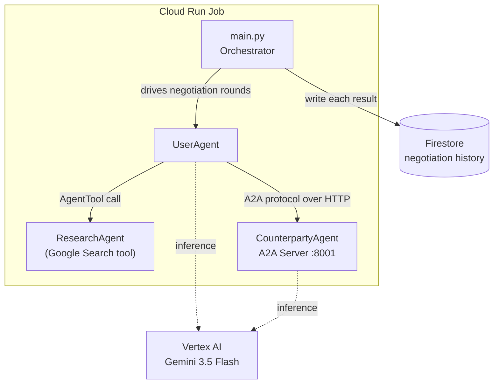

# 🤝 Haggle — AI-Powered Bill Negotiation Agent

<p align="center">
  
  
  
  
  
  
  
  
</p>

<p align="center"><b>Built for the All Things Agentic Hackathon — Taskmaster track</b></p>

---

Nobody wants to spend twenty minutes on the phone haggling over a subscription bill. **Haggle does it for you.**

Give it a list of services, current prices, and targets — it researches real competitor pricing, negotiates round-by-round against an AI playing each retention department, and comes back with a concrete total saved. Verified run: **3 services, 3 deals, $16.00/mo saved, $192/year, negotiated autonomously, end to end, on Google Cloud.**
🔗 **[Live dashboard](https://haggle-dashboard-535623739933.us-central1.run.app)**, real negotiation history, updated after every run.

## How it works

Two Gemini-powered agents negotiate against each other over Google's **A2A (Agent-to-Agent) protocol** — not a simulated back-and-forth inside a single prompt, but two independently running agents actually talking over HTTP. The whole thing runs as a **Cloud Run Job**: it starts, negotiates every service in the batch sequentially, logs each result to Firestore, and exits — no server to keep alive, no idle cost.



## Features

- 🔍 **Real leverage, not guesses** — a dedicated ResearchAgent uses Google Search grounding to find actual competitor prices before each negotiation starts
- 🤖 **Genuine agent-to-agent negotiation** — the CounterpartyAgent runs as a standalone A2A server; the UserAgent talks to it over real HTTP, not an in-process shortcut
- 🎭 **A persona with a hidden floor** — the retention rep has a real minimum price it will never reveal or cross, and concedes gradually like an actual human would
- 📦 **Multi-service batch mode** — point it at a whole subscription list and it negotiates every one autonomously, sequentially, ending in a single savings summary
- 🗄️ **Persistent memory via Firestore** — every negotiation's outcome is saved; the agent can report lifetime savings across every run it's ever done, not just the current session
- ☁️ **Deployed on Google Cloud** — runs as a Cloud Run Job, authenticated via Vertex AI ADC, no keys baked into the image
- ✅ **Tested** — 15 automated tests covering JSON parsing, instruction templating, and batch-summary arithmetic, run in under a second with zero API calls
- ⚙️ **Built entirely on Google's agent stack** — Gemini 3.5 Flash, Google ADK 2.0, and the A2A protocol

## Tech stack

| Layer | Technology |
|---|---|
| Model | Gemini 3.5 Flash (Vertex AI, global endpoint) |
| Agent framework | Google ADK 2.0 |
| Agent-to-agent comms | A2A Protocol |
| Research / grounding | Google Search tool |
| Persistence | Firestore (Native mode) |
| Deployment | Cloud Run Jobs (containerized via Docker) |
| Testing | pytest |

## Getting started (local)

**Prerequisites:** Python 3.10+, and either a Google Cloud project with Vertex AI enabled and billing attached, or a free [Gemini API key](https://aistudio.google.com) for local testing without any Cloud setup.

```bash
git clone https://github.com/abdullah-innit/haggle.git
cd haggle
pip install -r requirements.txt
cp .env.example .env
# fill in .env with your Vertex AI project details, or a Gemini API key
python main.py
```

### Negotiate multiple services in one run

```bash
python main.py --batch services.json
```

`services.json` is a simple list of `{service, current_price, target_price, max_price, floor_price}` objects — edit it or point `--batch` at your own file.

### Run the test suite

```bash
pytest -v
```

15 tests, no API key required — covers response parsing, agent instruction construction, and batch-summary math.

## Deploying to Google Cloud

Haggle ships with a `Dockerfile` and runs as a **Cloud Run Job** (a run-to-completion batch task, not an always-on web service — it doesn't need to be, since it doesn't serve live traffic).

```bash
# One-time setup
gcloud services enable run.googleapis.com artifactregistry.googleapis.com cloudbuild.googleapis.com firestore.googleapis.com
gcloud firestore databases create --location=us-central1 --type=firestore-native

# Build and deploy from source
gcloud run jobs deploy haggle-negotiator --source . --region=us-central1 --set-env-vars="GOOGLE_GENAI_USE_VERTEXAI=true,GOOGLE_CLOUD_PROJECT=YOUR_PROJECT_ID,GOOGLE_CLOUD_LOCATION=global" --memory=512Mi --task-timeout=1800 --max-retries=0

# Run it
gcloud run jobs execute haggle-negotiator --region=us-central1
```

Authentication uses Application Default Credentials automatically — the same code runs locally (your `gcloud` user credentials) and in Cloud Run (the Job's attached service account), with zero code changes between environments.

## Project structure

```
haggle/
├── agents/
│   ├── user_agent.py          # UserAgent + ResearchAgent (AgentTool-wrapped)
│   └── counterparty_agent.py  # Retention specialist persona
├── tools/
│   └── negotiation.py         # format_research leverage tool
├── tests/                     # pytest suite — no API key needed
├── main.py                    # Orchestrator — single or batch negotiation
├── counterparty_server.py     # Wraps CounterpartyAgent as an A2A HTTP server
├── storage.py                 # Firestore persistence for negotiation history
├── services.json              # Sample multi-service batch config
├── Dockerfile
├── requirements.txt
└── .env.example
```

## Why this track

Haggle is a **Taskmaster** project: it doesn't just talk about a chore, it does it. Point it at a real subscription list and it comes back with a specific number — money saved, or a clear-eyed "this one wasn't worth pushing further" — negotiated autonomously, running on real Google Cloud infrastructure.

## License

MIT — see [LICENSE](LICENSE) for details.
